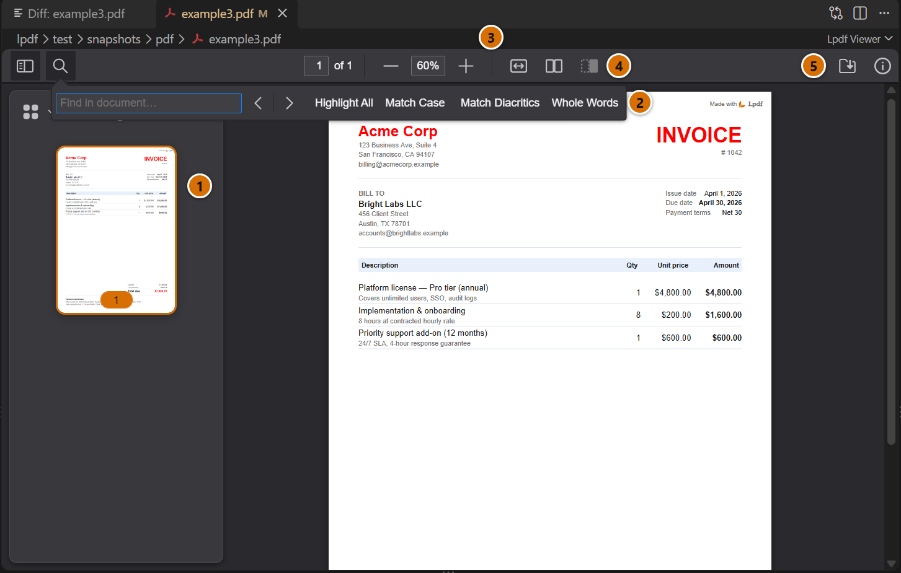
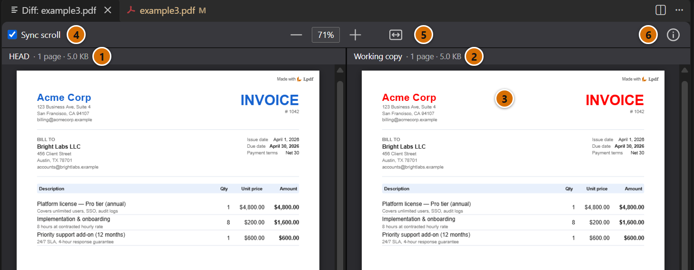
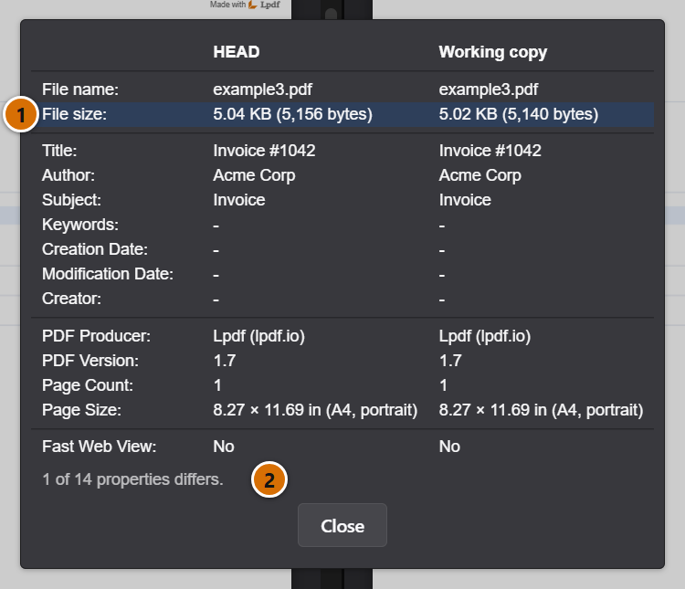
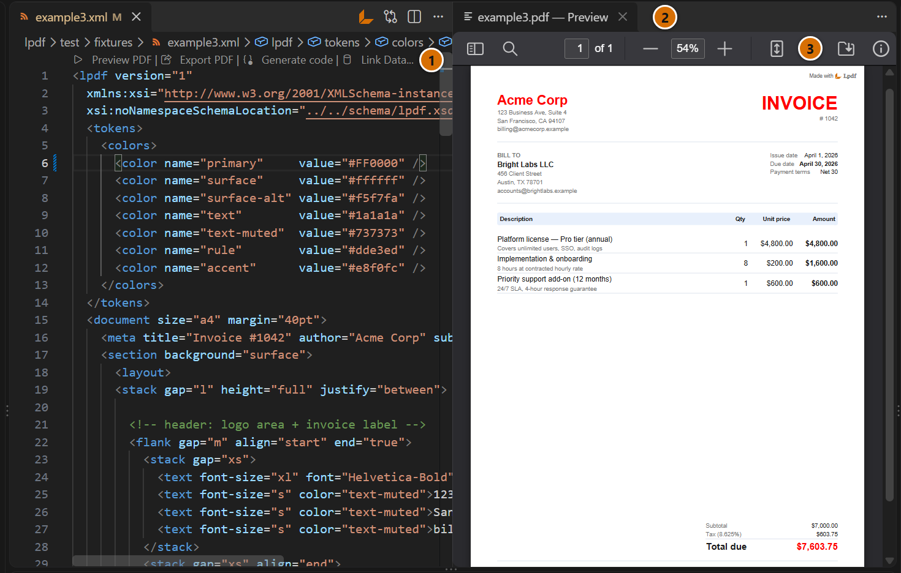
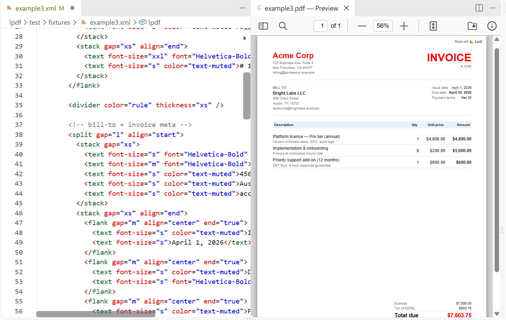
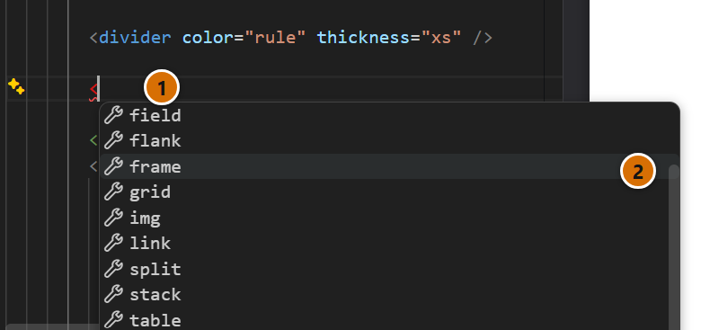
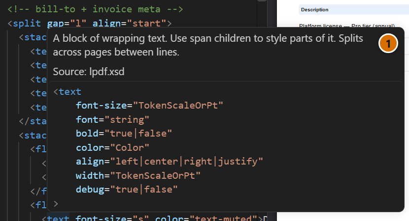
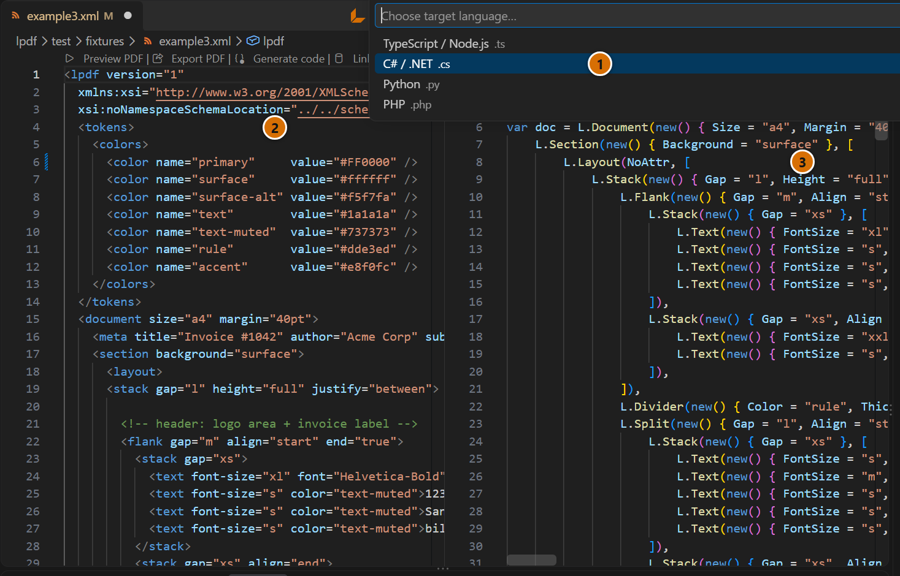

**View PDFs, compare modified PDFs, and author PDFs in XML with [Lpdf](https://lpdf.io?utm_campaign=vscode&utm_medium=referral&utm_source=readme) — PDF as Code on every platform**

A PDF viewer, a visual diff for PDFs you have modified, and authoring tools for Lpdf: you describe a document in XML, preview it live, and turn the template into SDK code for your platform. Everything runs on your machine.

## Open and compare PDFs

### PDF viewer

Open any `.pdf` file in VS Code: right-click it in the Explorer and select **Lpdf: View PDF**, or use the command palette. To open every PDF this way, turn on the `lpdf.defaultPdfViewer` setting. It follows your light or dark theme.

1. Page thumbnails.
2. Text search, with highlight all, match case, diacritics and whole words.
3. Zoom by field, buttons, pinch or Ctrl and the mouse wheel, from 10% to 1000%, with a toggle between fit to width and fit to page.
4. A two-page view, with or without a cover page.
5. Save, and document properties.

### Compare PDF with HEAD

See what changed in a modified PDF. Right-click it in the Explorer and select **Lpdf: Compare PDF with HEAD**, or use the button next to a changed PDF in the Source Control view. The version in your last commit and your working copy open side by side. The file needs a committed version in a git repository.

1. **HEAD**: the PDF as of your last commit, with its page count and size.
2. **Working copy**: the file on disk.
3. What changed: here, the colour of the heading.
4. **Sync scroll**: both sides scroll together. Untick it to scroll them apart.
5. One zoom for both sides: the buttons, a typed percentage, the fit button, or a pinch.
6. The info button: a table of both documents' properties.

<table>
<tr>
<td valign="top" width="42%">

The info button opens the two documents' properties, such as size, page count and producer, in two columns.

1. A property that differs is marked.
2. How many of them differ.

</td>
<td valign="top" width="58%">

</td>
</tr>
</table>

## Write PDFs in XML

Lpdf describes a document in XML, or in code, and renders a compact PDF that is identical on every platform. This extension is where you author them.

### Live preview

Any `.xml` file whose root element is `<lpdf>` is an Lpdf document, whatever it is named. Run **Lpdf: Preview PDF**, or use the buttons above `<lpdf>`, to open the rendered PDF beside your XML. It updates each time you save, and keeps your place and zoom. It is the same viewer as above, and it follows your light or dark theme.

1. Buttons above the root element: preview, export, generate code, and link a data file. The **Lpdf ◆** item in the status bar opens the preview too.
2. The preview, which updates when you save.
3. The viewer's toolbar, with search, zoom, page views, save and properties.

### Autocomplete, validation and hover docs

The XML is checked against the Lpdf schema as you type.

<table>
<tr>
<td valign="top" width="58%">

</td>
<td valign="top" width="42%">

Completion offers only what the schema allows at that point.

1. Mistakes are underlined as you type: here, the unfinished tag.
2. The elements that can go inside this one.

</td>
</tr>
</table>

<table>
<tr>
<td valign="top" width="42%">

Hover an element or an attribute for what it does, the attributes it takes, and the values each accepts. The text comes from the Lpdf schema.

1. What the element is for, and where the documentation comes from.

</td>
<td valign="top" width="58%">

</td>
</tr>
</table>

### Generate code

Run **Lpdf: Generate Code** to turn the saved XML into SDK code that builds the same document. It opens beside your template.

1. Choose the language: TypeScript, C#, Python or PHP.
2. Your template.
3. The code that builds the same document.

### Data, images and export

- **Data files.** Templates can bind to JSON data. A `<name>.json` file next to `<name>.xml` is picked up automatically, or choose any JSON file with **Lpdf: Link Data File...**. The preview updates when the data file changes, and export uses the same data.
- **Images and fonts.** `<image src="…">` and `` in `<assets>` load from disk. A relative path is looked up next to the XML file first, then in the root of the workspace folder. URLs are not downloaded.
- **Export.** Run **Lpdf: Export PDF** to render the current document, with its linked data, and save it to disk.

## Works offline

The Lpdf engine, PDF viewer, and export all run locally on your machine. No server round-trips, no accounts — your documents stay private. The extension collects no telemetry. The Red Hat XML extension it depends on asks for your consent to its own.

## Requirements

- [Red Hat XML](https://marketplace.visualstudio.com/items?itemName=redhat.vscode-xml) — required for XSD autocomplete and validation. It is installed automatically, also if you only use the PDF viewer.

## Docs

[lpdf.io/docs](https://lpdf.io/docs/?utm_campaign=vscode&utm_medium=referral&utm_source=readme)

## License

The extension is free to use, for any purpose. Previews and exports carry a "Made with Lpdf" line on every page.

The PDF viewer is built on [PDF.js](https://mozilla.github.io/pdf.js/), Mozilla's open-source PDF renderer, under the Apache License 2.0, with Lpdf's own toolbar around it. It, its fonts and its other components are listed with their licenses in [THIRD_PARTY_LICENSES](THIRD_PARTY_LICENSES).

The extension code is MIT licensed. The bundled Lpdf engine may be used through the extension by anyone, including for the PDFs it produces. See [LICENSE](LICENSE) for the terms. Using the engine in your own app is covered by the [Lpdf License](https://lpdf.io/license).

Pull requests are not accepted. Report bugs and request features at [github.com/lpdfio/lpdf/issues](https://github.com/lpdfio/lpdf/issues). See [CONTRIBUTING](CONTRIBUTING.md).
